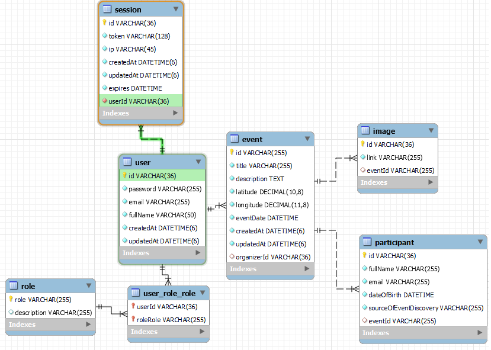

# app Docker Setup

1. Install NestJS globally on your system using the following command: `npm install -g @nestjs/cli`

2. Navigate to the root of the repository and run the app in Docker using the following commands in your terminal:
   `docker-compose build`
   `docker-compose up`

